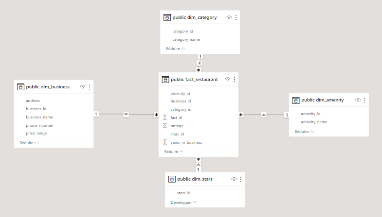
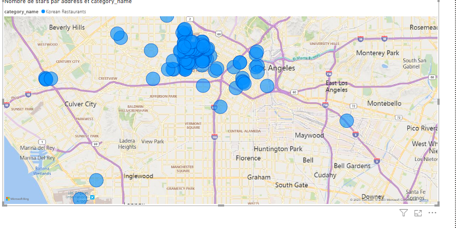

# Restaurants_etl

## About this project 
This project was about creating a Script to scrape the YellowPages website for restaurant data in the LA region. 
The collected data was then cleaned, put into a star schema database, and then pushed to an AWS RDS PostgreSQL instance.
After all of that, I created a PowerBI dashboard showcasing the data.

## Database Schema:

## Graphics from Power BI:
### One of the many analysis sections I tried to do, I performed a geographic analysis coupled with the type of restaurants.
This graph showcases the distribution of Korean-styled restaurants based on their price range:

